# FY2022 Project PLATEAU UC22-041「住民個人の避難行動立案支援ツール」の成果物
### 避難ルート検索とタイムラインに連動する画像・時刻表示を行うRe:Earth用プラグイン
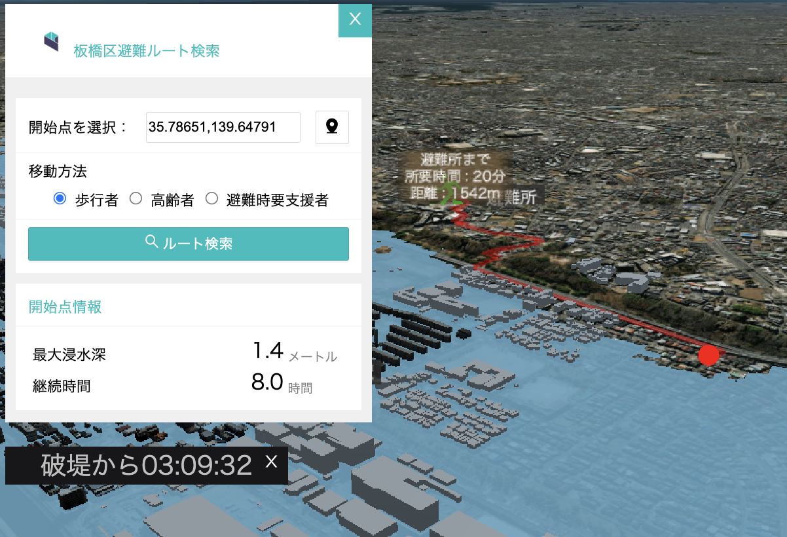

## 1. 概要
本プラグインを活用すると、オープンソースwebGISソフトウェアRe:Earthにおいて、指定地点から最寄りの避難施設までのルート検索や、Re:Earthのタイムラインに対応して経過時間や時間に応じた画像を表示させることができます。

### 留意点
- 本プラグインでは経路探索及び浸水情報提供のためのRDBMS及びAPIをユーザーが構築することを前提としています。
- API機能のシステム構築の手順及び詳細な仕様については[技術検証レポート「WebGIS技術を用いた水害対策アプリケーションの開発」](https://www.mlit.go.jp/plateau/file/libraries/doc/plateau_tech_doc_0011_ver01.pdf)を参照してください。
- 各APIの仕様については[3.3設定方法](#33-設定方法)を参照してください。

## 2.「ARを活用した災害リスク可視化ツール」および「住民個人の避難行動立案支援ツール」について
### 2.1 ユースケースの概要
本ユースケースは、3D都市モデルの優れたビジュアライゼーションの機能を活用し、WebGISの技術と組み合わせることで、住民等向けに水害リスクを分かりやすく可視化するとともに、個人の避難行動計画の立案を支援するためのソリューションを提供することを目的としています。

### 2.2 開発システムの概要
3D都市モデルを活用し、洪水による浸水の広がりや、浸水範囲に応じた適切な避難ルートの検索・可視化を行う「避難ルート検索システム」と、本システムで作成した避難ルート及び洪水による最大浸水深をAR空間に臨場感を持って表現するアプリケーションを開発しました。
更に、「避難ルート検索システム」をWebGIS上のGUIでユーザーが直観的に操作できるようにするため、オープンソースGISであるRe:Earthを活用し、3D地図上の任意の地点のクリックまたは緯度・経度の入力による出発地の取得や、出発地から目的地までの避難ルート検索結果のAPIを通じた取得を行うためのプラグインを開発しました。

#### 避難ルート検索システム<!-- omit in toc -->
マップで指定した地点の座標を取得し、その地点の浸水情報を 表示します。また、その地点から避難施設までの最短ルートと所要時間をマップに表示させることができます。

#### タイムラインイメージシステム<!-- omit in toc -->

Re:Earth上のタイムラインと連動して、Re:Earthの現在時刻からの経過時間を表示することができます。また必要に応じて特定の時間帯に合わせて画像を画面上に表示させることができます。

##### タイムライン機能の追加
タイムラインを操作するには、あらかじめRe:Earthのタイムライン機能を追加しておく必要があります。 タイムライン機能の追加方法は
1. 画面左メニューの「シーン」をクリックします。
2.  画面右のタイムラインの項目内の「タイムライン」をオンにします。
3.  現在時刻に初期時刻としたい日時を入力します。時刻の指定は[ISO 8601](https://ja.wikipedia.org/wiki/ISO_8601)で指定してください。（例：2021-11-01T01:00:00.000Z）

#### サンプルデータ<!-- omit in toc -->
- 降雨波形画像
  タイムラインイメージシステムを使用して、時間に応じて表示させる画像です。
   「3.3 設定方法 の　[3.3.2 タイムラインイメージシステム](#332-タイムラインイメージシステム) を参照してください。
   ファイル名とデータの内容の対応は以下の通りです。

| ファイル名                                             | データ説明                                                                        | 使用箇所                                                                                                                                              |
| ------------------------------------------------------ | --------------------------------------------------------------------------------- | ----------------------------------------------------------------------------------------------------------------------------------------------------- |
| Rainfall_waveform(t=**x**h).png (**x**は0~35の数値) | タイムラインイメージシステムで使用する画像                                        | ・「3.3 設定方法 の　[3.3.2 タイムラインイメージシステム](#332-タイムラインイメージシステム) を参考にタイムラインイメージシステムで設定してください。 |
| Timeline_setting.csv                                   | タイムラインイメージシステムで使用する画像とStartTime	とEndTimeの設定時刻の対応表 | ・「3.3 設定方法 の　[3.3.2 タイムラインイメージシステム](#332-タイムラインイメージシステム) を参考にタイムラインイメージシステムで設定してください。 |  |

## 3. 利用手順

### 3.1 環境の準備

プラグインを利用するために、以下を設定します。
- Re:Earthのプロジェクトの作成
- プラグインのインストール

#### アカウント作成
（1）[https://reearth.io/](https://reearth.io/)にアクセスしページ右上の「Start now」をクリックします。

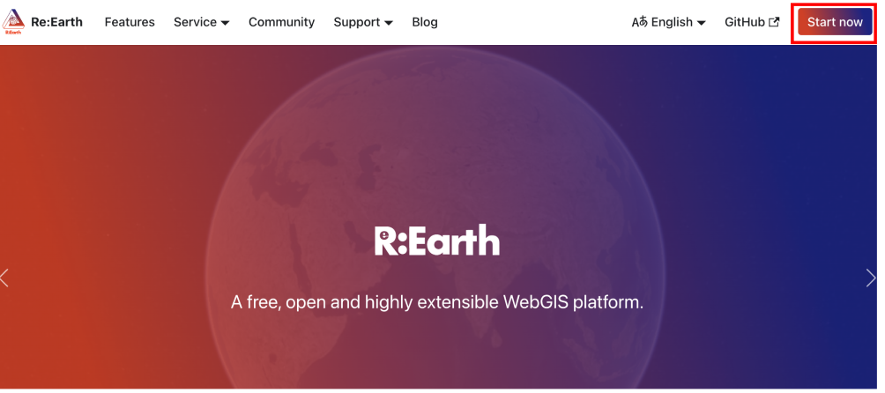

(2) 「Sign Up」からメールアドレス、ユーザー名、パスワードを入力して、「SIGN UP」をクリックすることで、アカウントを作成することができます。
既にアカウントを持っている場合は「Log In」からユーザー名とパスワードを入力してRe:Earthにログインしてください。

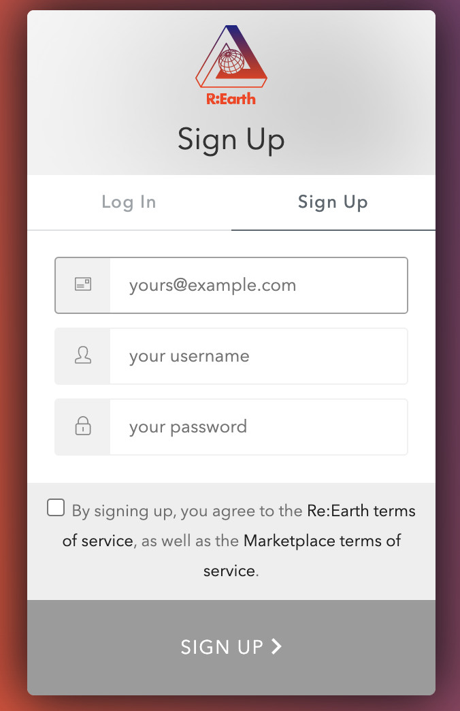

(3) Re:Earthにログインするとダッシュボード画面が表示されます。

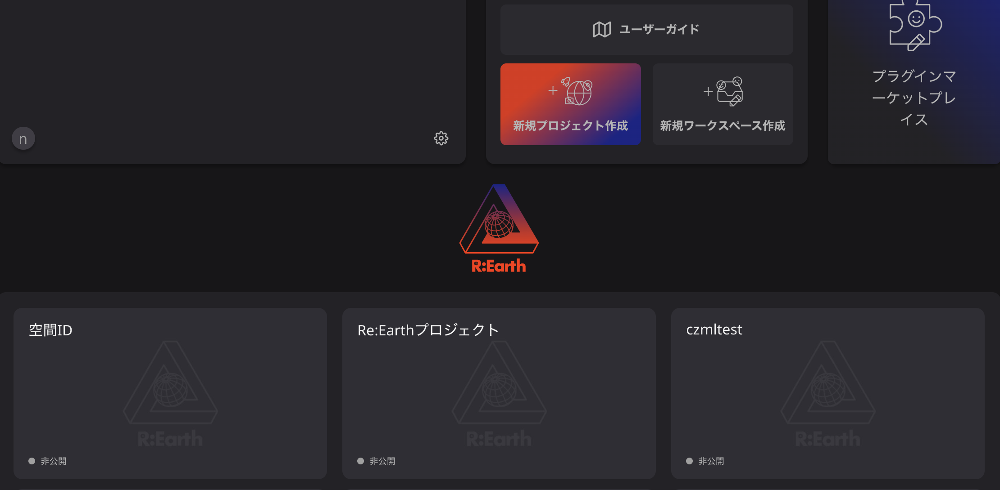

#### Re:Earthのプロジェクトの作成
（1） 「新規プロジェクト作成」ボタンをクリックします。
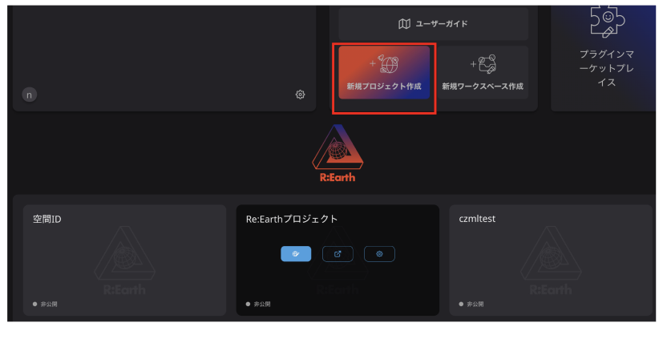

（2）「プロジェクト名」を入力し、「作成」ボタンをクリックします。
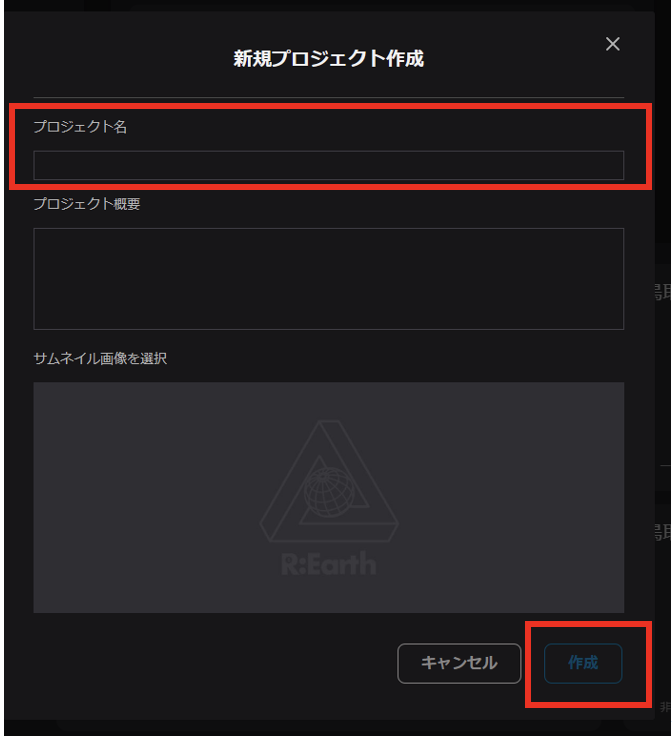

（3）プロジェクトのボードが作成されるので、編集するプロジェクトボードにマウスカーソルをあてます。
     ボタンが３つ表示されるので、一番左の「編集ボタン」をクリックします。
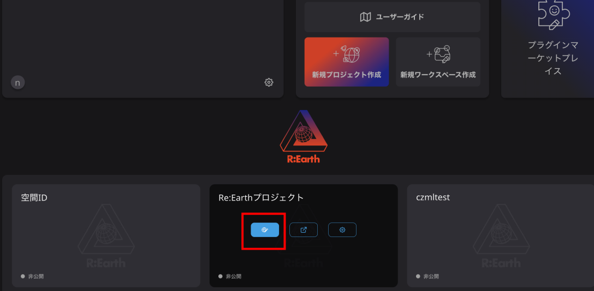

（4）マップの編集ページが表示されます。編集ページは主に４つの領域で構成されています。
   - ツールバー：レイヤーを追加する際に使用する。
   - マップ表示領域：地図が表示されます。
   - アウトライン：マップに追加しているレイヤーやプラグインによるウィジェットを管理します。
   - 設定項目：レイヤーやプラグインの各種設定を行います。
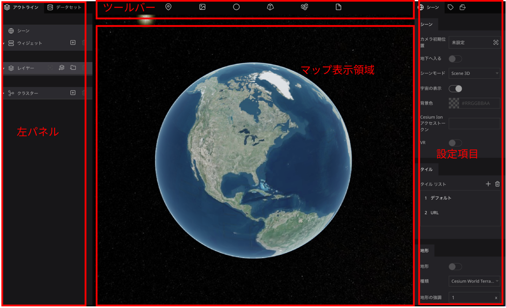

### 3.2 インストール方法

1. Re:Earthのプロジェクト編集ページを開き、ページ上部のプロジェクト名をクリックし、「プラグイン」をクリックしてプラグインページを開きます。
   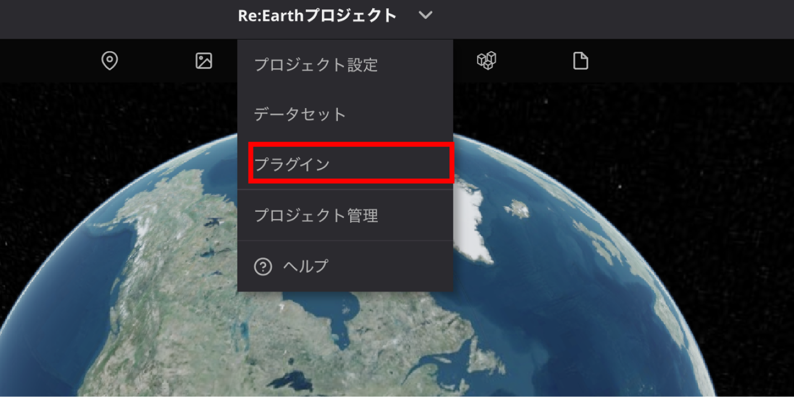

2. プラグインページから「個人インストール済み」タブを開きます。
3. プラグインをzipファイルからインストールします。「PCからZipファイルをアップロード」を選択し、[ダウンロード](../../releases/latest)したzipファイルを選択します。
   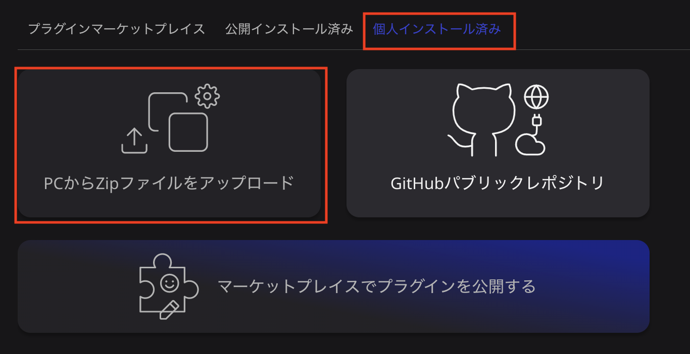

4. プロジェクトの編集画面に戻り、ウィジェットの追加から「避難ルート検索ウィジェット」および「タイムラインイメージ ウィジェット」を追加します。
  
   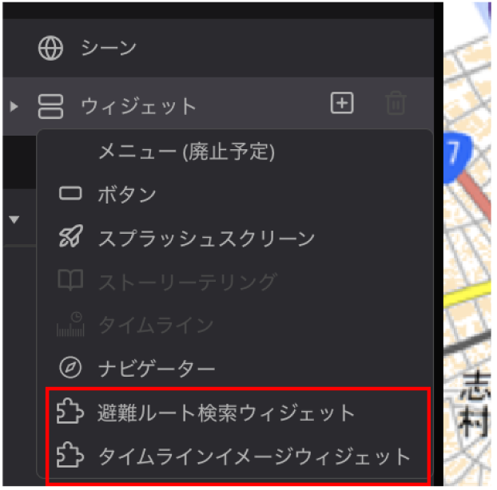

### 3.3 設定方法

#### 3.3.1 避難ルート検索システム
本プラグインを利用するには、避難ルート検索APIおよび浸水情報取得APIのリクエストURLとアクセストークンが必要になります。
画面左側アウトラインの部分の「ウィジェット」から「避難ルート検索ウィジェット」をクリックすると画面右側に避難ルート検索システムの設定項目が表示されます。

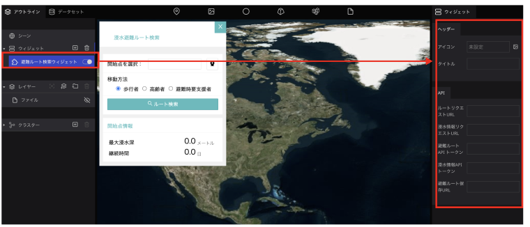　

##### ヘッダーの設定
  
 ウィジェットのヘッダー部分に表示されるタイトルを変更したり、任意の画像を設定することが可能です。
 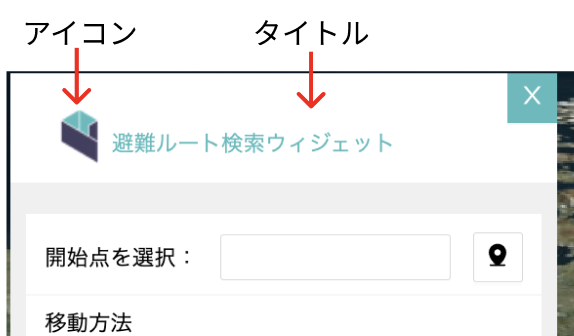　

- ①アイコン：設定項目のうち、アイコンの「未設定」の文字をクリックすると、アセット選択ウインドウが表示されます。設定したい画像を選択し、「選択」ボタンをクリックすると、アイコン画像が設定されます。
- ②タイトル：タイトルの入力欄に入力した値がヘッダーのタイトルに設定されます。未指定の場合はタイトルが「浸水避難ルート検索」になります。

 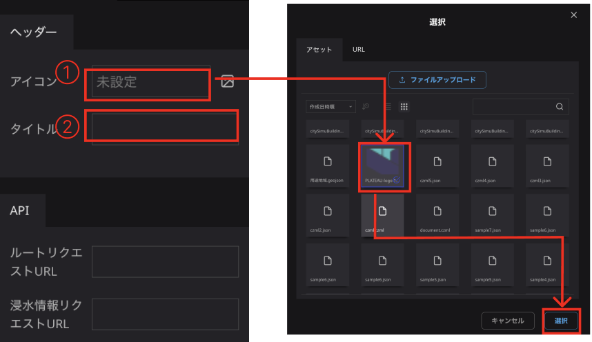　

#### APIの設定
1. 避難ルート検索API実行用のリクエストURLを入力します。
2. 避難ルート検索API実行用のアクセストークンを入力します。
3. 選択地点の浸水情報取得API実行用のリクエストURLを入力します。
4. 選択地点の浸水情報取得API実行用のアクセストークンを入力します。
5. 避難ルートAPI実行時によって算出されたルートの保存先のURLを入力します。（ARアプリ利用時用）

 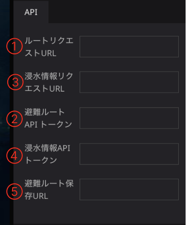　

##### 避難ルート検索APIの仕様

  - プロトコル ---- HTTPS
  - メソッド ----- POST
  - レスポンス ----- JSON形式 

リクエストパラメーター

| パラメータ名 | 名称     | 説明         | 値                                             |
| ------------ | -------- | ------------ | ---------------------------------------------- |
| latitude     | 緯度     | 対象の緯度   | DEG形式 例) 35.80854167                     |
| longitude    | 経度     | 対象の経度   | DEG形式 例) 139.61281250                    |
| type         | 属性     | 利用者の属性 | 1 : 歩行者 2 : 高齢者 3 : 避難時要支援者 |
| token        | トークン | トークン     | 任意で設定                                     |

レスポンス 

| 項目       | 値               | 説明                           |
| ---------- | ---------------- | ------------------------------ |
| MINEタイプ | application/json | JSON形式のデータを返却します。 |
| 文字セット | utf-8            |                                |   |

| フィールド | 名称       | 説明                                                                                                                                                                                  |
| ---------- | ---------- | ------------------------------------------------------------------------------------------------------------------------------------------------------------------------------------- |
| status     | ステータス | APIへの問い合わせ結果 200 ----- 正常 400 ----- パラメータエラー(必須項目がない) 401 ----- パラメータエラー(データが存在しない) 403 ----- トークンエラー(トークンが異なる) |
| czml       | データ     | レスポンスデータ本体(CZML)                                                                                                                                                            |    |

##### 浸水情報取得APIの仕様
  - プロトコル ---- HTTPS
  - メソッド ----- POST
  - レスポンス ----- JSON形式 

リクエストパラメーター

| パラメータ名 | 名称     | 説明       | 値                          |
| ------------ | -------- | ---------- | --------------------------- |
| latitude     | 緯度     | 対象の緯度 | DEG形式 例) 35.80854167  |
| longitude    | 経度     | 対象の経度 | DEG形式 例) 139.61281250 |
| token        | トークン | トークン   | 任意で設定                  |

レスポンス 

| 項目       | 値               | 説明                           |
| ---------- | ---------------- | ------------------------------ |
| MINEタイプ | application/json | JSON形式のデータを返却します。 |
| 文字セット | utf-8            |                                |   |

| フィールド | 名称       | 説明                                                                                                                                                                                  |
| ---------- | ---------- | ------------------------------------------------------------------------------------------------------------------------------------------------------------------------------------- |
| status     | ステータス | APIへの問い合わせ結果 200 ----- 正常 400 ----- パラメータエラー(必須項目がない) 401 ----- パラメータエラー(データが存在しない) 403 ----- トークンエラー(トークンが異なる) |
| data       | データ     | レスポンスデータ本体                                                                                                                                                                  |   |

レスポンスデータ本体

| フィールド | 名称           | 説明                                 |
| ---------- | -------------- | ------------------------------------ |
| mesh       | メッシュコード | リクエストされた座標のメッシュコード |
| depth      | 最大浸水深     | 最大浸水深(m)                        |
| time       | 浸水継続時間   | 浸水継続時間(分)                     |

- リクエストAPIが行う避難ルート検索および選択地点の浸水情報取得の処理方法の詳細については、[技術検証レポート「WebGIS技術を用いた水害対策アプリケーションの開発」](https://www.mlit.go.jp/plateau/file/libraries/doc/plateau_tech_doc_0011_ver01.pdf)を参照してください。

#### 3.3.2 タイムラインイメージシステム

画面左側アウトラインの部分の「ウィジェット」から「タイムラインイメージウィジェット」をクリックすると画面右側にタイムラインイメージシステムの設定項目が表示されます。

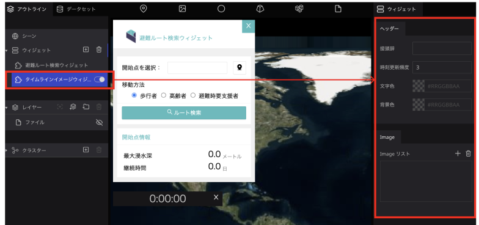　

##### ヘッダーの設定
  
タイムラインシステムのヘッダー設定では、以下の項目を設定することができます。

  - 接頭辞：時刻表記の先頭に任意の文字を表示させることができます。
  - 時刻更新頻度：表示時刻の更新頻度を指定することができます。デフォルトは3秒です。
  - 文字色：表示時刻の文字色を変更することができます。
  - 背景色：背景色を変更することができます。

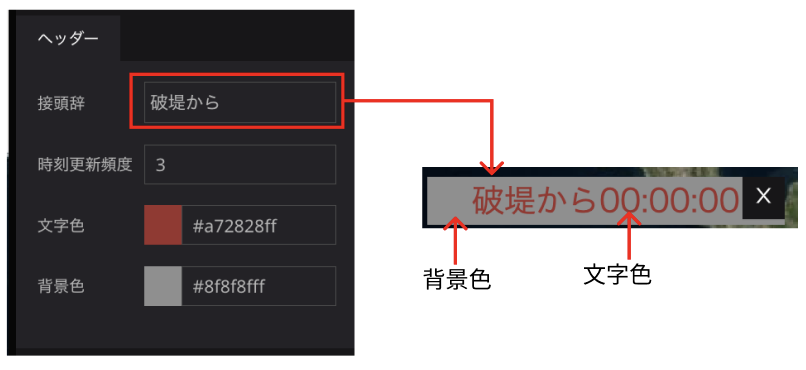　

#### 画像の設定
タイムラインと連動して画像を表示させる設定を行なっていきます。
（本READMEではサンプルデータ「Timeline_setting.csv」の１つ目の画像を設定します。
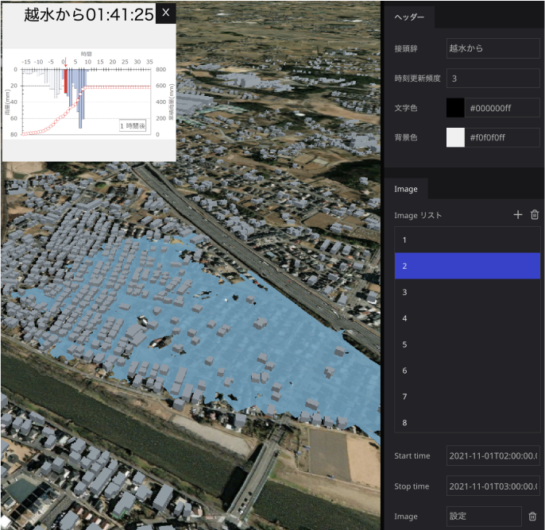

1. Imageリストの[+]をクリックすると、リストに項目が１つ追加されます。
2. 追加された項目をクリックし、Start timeに画像が表示され始める時刻を指定します。「2021-11-01T01:00:00.000Z」と入力してください。（時刻の指定は[ISO 8601](https://ja.wikipedia.org/wiki/ISO_8601)で指定してください。）
3.  Stop timeに画像の表示終了時刻を指定します。「2021-11-01T02:00:00.000Z」と入力してください。（時刻の指定は[ISO 8601](https://ja.wikipedia.org/wiki/ISO_8601)で指定してください。）
4.   指定した時刻の間に表示させる画像をImageから指定します。Imageの項目の「未設定」となっている文字をクリックするとアセットの選択ウインドウが表示されます。「ファイルアップロード」をクリックし、設定する画像をアップロードします。アップロードすると画像が一覧に追加されるので、クリックして選択し、「選択」ボタンをクリックします。

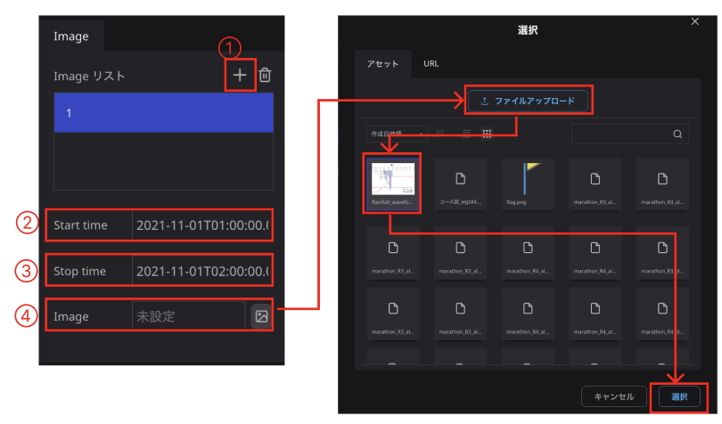

さらに画像を設定する場合は、[+]をクリックして項目を追加してください。

### 3.4 使い方

#### 避難ルート検索システム

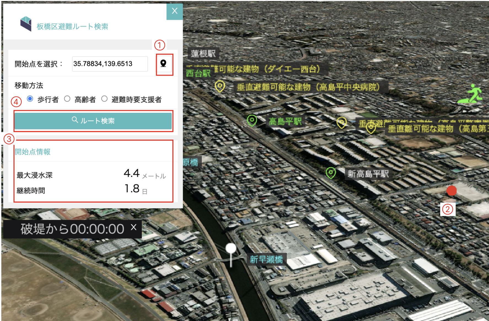
1. 地点選択のアイコンをクリックします。
2. マップ上で任意の地点をクリックします。
3. クリックした地点の最大浸水深と浸水継続時間が表示されます。
4. 移動方法を選択し、ルート検索ボタンをクリックすると、指定地点から最寄りの避難所までのルートが表示されます。

#### タイムラインイメージシステム
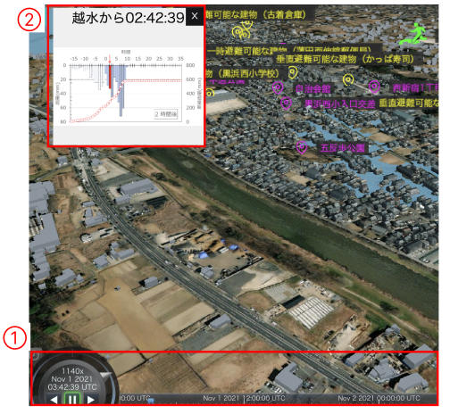
1. Re:Earthのタイムラインの再生ボタン、逆再生ボタンをクリックしたりシークバーを操作することで時間を変化させることができます。
2. タイムラインの時間に応じて経過時間と、画像を設定している場合、経過時刻の下にタイムラインイメージウィジェットで設定した時間帯の画像が表示されます。

## ライセンス
* ソースコードおよび関連ドキュメントの著作権は国土交通省に帰属します。
* 本ドキュメントは[Project PLATEAUのサイトポリシー](https://www.mlit.go.jp/plateau/site-policy/)（CCBY4.0および政府標準利用規約2.0）に従い提供されています。

## 注意事項
- 本リポジトリは参考資料として提供しているものです。動作保証は行っておりません。
- 予告なく変更・削除する可能性があります。
- 本リポジトリの利用により生じた損失及び損害等について、国土交通省はいかなる責任も負わないものとします。

## 参考資料
- （近日公開）技術検証レポート「WebGIS技術を用いた水害対策アプリケーションの開発」: https://www.mlit.go.jp/plateau/libraries/technical-reports/
- PLATEAU Webサイト Use caseページ「ARを活用した災害リスク可視化ツール」：https://www.mlit.go.jp/plateau/use-case/uc22-026/
- PLATEAU Webサイト Use caseページ「住民個人の避難行動立案支援ツール」：https://www.mlit.go.jp/plateau/use-case/uc22-041/
- Re:Earth：[https://reearth.io/](https://reearth.io/)
